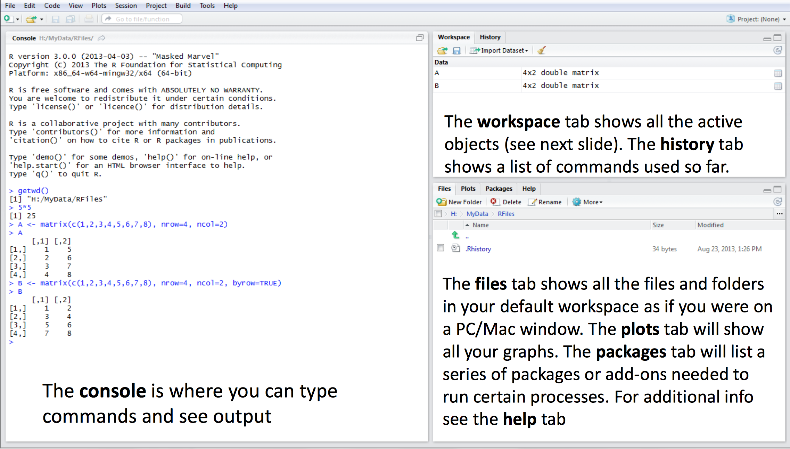

## What is R? Why R?
Wiki:

R is a programming language and software environment for statistical computing and graphics.

- Widespread among statisticans
- A bunch of libraries
- Easy to learn
- A little overhead for doing statistics

## Installing R

R: http://www.r-project.org

R Studio: http://www.rstudio.com

##Literature

- R Quickguide: http://cran.r-project.org/doc/contrib/Torfs+Brauer-Short-R-Intro.pdf
- Stowell. Using R for Statistics, 2014
- Alain F. Zuur. A beginner's guide to R
- Eric D. Kolaczyk. Statistical analysis of Network Data with R
 

## R Studio 



Different approaches

- Create full listing of code
- Type command-by-command in console

## Installing libraries

- igraph

## Something easy


```r
10^2 + 36
```

```
## [1] 136
```

```r
a = 4
a * 5
```

```
## [1] 20
```

## Vectors

```r
b = c(3,4,5)
b * 2
```

```
## [1]  6  8 10
```

```r
d = c(6,7,8)
b + d
```

```
## [1]  9 11 13
```

## Functions

```r
(3+4+5)/3
```

```
## [1] 4
```
or

```r
mean(x=b)
```

```
## [1] 4
```

## Help!

If you are stoned by what is doing this word in your code, try to write:

- `help(mean)`
- `?mean`

and look at the bottom right window.

## Plot


```r
x = rnorm(100)
plot(x)
```

 

## Graphics


```r
plot(rnorm(100), type="l", col="gold")
```

 

## Graphics


```r
hist(rnorm(100))
```

 

## Matricies


```r
mat=matrix(data=c(9,2,3,4,5,6),ncol=3)
```

## Loading data
You can move to the directory with your data

```r
getwd()
setwd('./path/to/your/data/')
iris = read.csv(file = 'iris.data',header = 0) 
# that gives you a DataFrame!
```


